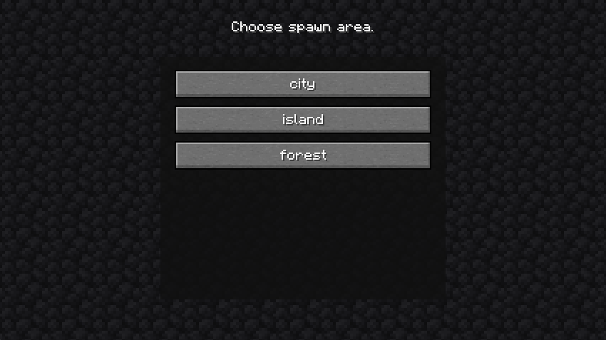

# About

* Minecraft: **1.20.1**
* Mod Launcher: **Forge**

A simple mod that allows you to configure random spawns for new players entering a Minecraft server.

The killer feature of this random spawn mod is that, instead of limiting you to the world’s center coordinates, 
you can configure multiple differently sized areas where players can spawn randomly. Even better, you can let players choose 
in which area they would like to spawn.

# Build
## Requirements
To build this project you need `Gradle` version `8.8` and `Java SDK` version `22.0.2`.

You can check your `Java SDK` version with the following command:
```
javac -version
```
And your `Gradle` version with:
```
gradle -version
```

## Build Jar
Once all requirements are satisfied, run `Gradle` in your repository folder:
```
gradle build
```
This command creates a `build/libs` folder in your repository. You can find the `jar` file there.

# How it works

When a player enters the server for the first time, the mod puts them into Spectator mode and lets them choose a spawn area.
Once the player selects an area, the mod tries random block positions on the area’s heightmap. 
When it finds a valid position, it teleports the player there and switches their game mode back.  
**Note:** Currently only Creative and Survival game modes are supported. Players cannot start in Adventure or Spectator mode.

If the mod fails to find a suitable spawn position, it falls back to the world’s default spawn.

# Configuration

After the first server launch, a `RandomSpawn.toml` file is created in the `config` folder.

```toml
[Config]
    RandomSpawnOnEachLogin = false
    MaxTries = 50
    "biome Blacklist" = ["mod1:biome2", "mod3:biome4"]
    "block Blacklist" = ["minecraft:magma_block", "minecraft:cactus", "minecraft:lava"]
    RandomSpawnArea = false

[[areas]]
    shape = "square"
    name = "default"
    x = 0
    z = 0
    radius = 100

```
* `RandomSpawnOnEachLogin` – enables random spawn every time a player logs in. Useful for debugging.  
* `MaxTries` – how many random block positions will be tested before giving up.  
* `biome Blacklist` – list of biomes to avoid when searching for a spawn point.  
* `block Blacklist` – list of blocks to avoid when searching for a spawn point.  
* `RandomSpawnArea` – if true, players cannot choose an area; the server picks randomly (all areas have an equal chance).  
* `shape` – shape of the spawn area (`circle` or `square`).  
* `name` – name of the area, shown in the GUI.  
* `x` and `z` – coordinates of the area’s center.  
* `radius` – radius of the spawn area.  

You can define as many `areas` as you wish. For example:

```toml
[Config]
    RandomSpawnOnEachLogin = false
    MaxTries = 50
    "biome Blacklist" = ["mod1:biome2", "mod3:biome4"]
    "block Blacklist" = ["minecraft:magma_block", "minecraft:cactus", "minecraft:lava"]
    RandomSpawnArea = false

[[areas]]
    shape = "square"
    name = "city"
    x = 250
    z = 900
    radius = 250

[[areas]]
    shape = "circle"
    name = "island"
    x = -900
    z = -76
    radius = 1000

[[areas]]
    shape = "circle"
    name = "forest"
    x = 1450
    z = 250
    radius = 670

```

For the player, it will look like this:


